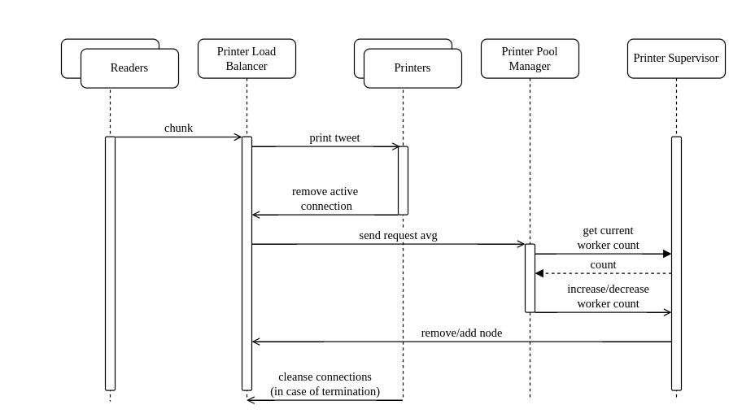

# FAF.PTR16.1 -- Project 1
> **Performed by:** Magal Vlada, group FAF-203
> **Verified by:** asist. univ. Alexandru Osadcenco

## P1W1

**Diagrams**


**Tasks**

The **minimal tasks** were to create an actor that reads the stream and an actor that prints the tweets (Reader and Printer):

```elixir
defmodule Week1.Reader do
  use GenServer
  require Logger

  def start_link(state) do
    GenServer.start_link(__MODULE__, state)
  end

  def init(state) do
    Logger.info("Stream reader #{inspect(self())} is up.")
    HTTPoison.get(state[:url], [], recv_timeout: :infinity, stream_to: self())
    {:ok, state}
  end

  def handle_info(%HTTPoison.AsyncChunk{chunk: chunk}, state) do
    Printer.print_tweet(state[:printer_pid], chunk)
    Week1.Statistics.analyze_chunk(chunk)
    {:noreply, state}
  end

  def handle_info(%HTTPoison.AsyncStatus{} = status, state) do
    Logger.debug("Connection status: #{inspect(status)}")
    {:noreply, state}
  end

  def handle_info(%HTTPoison.AsyncHeaders{} = headers, state) do
    Logger.debug("Connection headers: #{inspect(headers)}")
    {:noreply, state}
  end
end
```

The **main tasks** were to 1) add another Reader and 2) simulate work by making the Printer sleep a certain amount when processing tweets. I used Poisson distribution to determine the amount of time.

```elixir
defmodule Printer do
  use GenServer
  require Logger

  def start_link(rate_param) do
    GenServer.start_link(__MODULE__, rate_param)
  end

  def init(rate_param) do
    Process.flag(:trap_exit, true)
    Logger.info("Printer #{inspect(self())} is up.")
    {:ok, rate_param}
  end

  def print_tweet(pid, chunk) do
    GenServer.cast(pid, {:print_tweet, chunk})
  end

  def handle_cast({:print_tweet, chunk}, rate_param) do
    :timer.sleep(round(Statistics.Distributions.Poisson.rand(rate_param)))

    "event: \"message\"\n\ndata: " <> message = chunk
    {success, data} = Jason.decode(String.trim(message))

    if success == :ok do
      Logger.info("Received tweet: #{inspect(data["message"]["tweet"]["text"])} \n")
    else
      exit(:panic_msg)
    end

    {:noreply, rate_param}
  end

  def terminate(reason, _state) do
    Logger.error("Printer #{inspect(self())} going down, reason: #{inspect(reason)}")
  end
end
```

The **bonus task** was to print the most popular hashtags each 5 seconds:

```elixir
defmodule Week1.Statistics do
  use GenServer
  require Logger

  def start_link(state) do
    GenServer.start_link(__MODULE__, state, name: __MODULE__)
  end

  def init(state) do
    Logger.info("Statistics analyzer #{inspect(self())} is up.")
    :timer.send_after(state[:period], self(), :print)
    {:ok, state}
  end

  def analyze_chunk(chunk) do
    GenServer.cast(__MODULE__, {:analyze, chunk})
  end

  def handle_cast({:analyze, chunk}, state) do
    map = state[:hashtags]
    "event: \"message\"\n\ndata: " <> message = chunk
    {success, data} = Jason.decode(String.trim(message))

    if success == :ok do
      hashtags_data = data["message"]["tweet"]["entities"]["hashtags"]

      cond do
        length(hashtags_data) > 0 ->
          updated =
            Enum.reduce(hashtags_data, map, fn h, acc ->
              hashtag = h["text"]
              cnt = Map.get(state[:hashtags], hashtag, 0) + 1
              Map.put(acc, hashtag, cnt)
            end)

          {:noreply, %{state | hashtags: updated}}

        true ->
          {:noreply, state}
      end
    else
      Logger.warn("Failed to decode message: #{inspect(data)}")
      {:noreply, state}
    end
  end

  def handle_info(:print, state) do
    sorted = Enum.sort(state[:hashtags], fn {_, v1}, {_, v2} -> v1 > v2 end)
    Logger.info("Most popular hashtags in the last 5 seconds are:")
    for i <- 0..4, do: IO.inspect(Enum.at(sorted, i))
    :timer.send_after(state[:period], self(), :print)
    {:noreply, %{state | hashtags: %{}}}
  end
end
```

## P1W2

**Diagrams**


**Tasks**

The **minimal tasks** were about creating a Pool of Printers and a Load Balancer to distribute tweets between them:

```elixir
defmodule LoadBalancer do
  use GenServer
  require Logger

  def start_link(nr_nodes) do
    GenServer.start_link(__MODULE__, nr_nodes, name: __MODULE__)
  end

  def init(nr_nodes) do
    Logger.info("Load balancer #{inspect(self())} is up.")
    nodes = for i <- 0..(nr_nodes - 1), into: %{}, do: {i, 0}

    Logger.debug(inspect(nodes))
    {:ok, %{nr_nodes: nr_nodes, msg_nr: 0, nodes: nodes}}
  end

  def send_chunk(chunk) do
    GenServer.cast(__MODULE__, {:send, chunk})
  end

  def remove_active_conn(node) do
    GenServer.cast(__MODULE__, {:rm_active_conn, node})
  end

  def handle_cast({:rm_active_conn, node}, state) do
    nodes = Map.put(state[:nodes], node, state[:nodes][node] - 1)
    Logger.debug("Printer #{node} is done; #{inspect(nodes)}")
    {:noreply, %{state | nodes: nodes}}
  end

  def handle_cast({:send, chunk}, state) do
    node = state[:nodes] |> Enum.sort(fn {_, v1}, {_, v2} -> v1 < v2 end) |> Enum.at(0) |> elem(0)

    printer = PrinterSupervisor.get_process(node)
    nodes = Map.put(state[:nodes], node, state[:nodes][node] + 1)

    Week2.Printer.print_tweet(printer, chunk, node)

    {:noreply, %{state | msg_nr: state[:msg_nr] + 1, nodes: nodes}}
  end
end
```

The Load Balancer distrbuted tweets using the Least Connected Algorithms (**bonus task**). It has a map which records how many tweets have been sent to each one printer. When the printer has finished processing the tweet, it sends a message to the LB to decrease its counter (a.k.a. removes an active connection). Based on this, the LB chooses the printer with the least amount of active connections to send the tweet to.

```elixir
defmodule Week2.Printer do
  use GenServer
  require Logger

  def start_link(rate_param) do
    GenServer.start_link(__MODULE__, rate_param)
  end

  def init(rate_param) do
    Process.flag(:trap_exit, true)
    Logger.info("Printer #{inspect(self())} is up.")
    {:ok, rate_param}
  end

  def print_tweet(pid, chunk, node) do
    GenServer.cast(pid, {:print_tweet, chunk, node})
  end

  def handle_cast({:print_tweet, chunk, node}, rate_param) do
    :timer.sleep(round(Statistics.Distributions.Poisson.rand(rate_param)))

    "event: \"message\"\n\ndata: " <> message = chunk
    {success, data} = Jason.decode(String.trim(message))

    if success == :ok do
      Logger.info("Received tweet: #{inspect(data["message"]["tweet"]["text"])} \n")
    else
      exit(:panic_msg)
    end

    LoadBalancer.remove_active_conn(node)
    {:noreply, rate_param}
  end

  def terminate(reason, _state) do
    Logger.error("Printer #{inspect(self())} going down, reason: #{inspect(reason)}")
  end
end
```

The **main task** was to kill printers in case of a panic message. As you can see above, the printer exits if it receives such a a message.

## P1W3

**Diagrams**


**Tasks**

The **minimal task** was to censor tweets:
```elixir
defmodule Week3.Printer do
  use GenServer
  require Logger

  def start_link({rate_param, node}) do
    GenServer.start_link(__MODULE__, {rate_param, node})
  end

  def init({rate_param, node}) do
    Process.flag(:trap_exit, true)
    Logger.info("Printer #{inspect(self())} is up.")

    swearwords =
      File.read!("lib/week3/swearwords.json")
      |> Jason.decode!()

    {:ok, {rate_param, node, swearwords}}
  end

  def print_tweet(pid, chunk, node) do
    GenServer.cast(pid, {:print_tweet, chunk, node})
  end

  def handle_cast({:print_tweet, chunk, node}, {rate_param, _node, swearwords}) do
    time = Statistics.Distributions.Poisson.rand(rate_param)
    "event: \"message\"\n\ndata: " <> message = chunk
    {success, data} = Jason.decode(String.trim(message))

    tweet = data["message"]["tweet"]["text"]
    redacted = censor_tweet(tweet, swearwords)

    if success == :ok do
      if !Week3.HashKeeper.has_hash?(tweet) do
        Week3.HashKeeper.add_hash(tweet)
        :timer.sleep(round(time))
        Logger.info("Received tweet: #{redacted}  \n")
      end
    else
      exit(:panic_msg)
    end

    Week3.LoadBalancer.remove_active_conn(node)
    {:noreply, {rate_param, node, swearwords}}
  end

  def terminate(reason, {_rate_param, node, _swearwords}) do
    Week3.LoadBalancer.cleanse_conn(node)
    Logger.error("Printer #{inspect(self())} going down, reason: #{inspect(reason)}")
  end

  def censor_tweet(tweet, swearwords) do
    tweet
    |> String.split(" ", trim: true)
    |> Enum.map(fn word ->
      w = String.downcase(word)

      if w in swearwords do
        String.duplicate("*", String.length(w))
      else
        w
      end
    end)
    |> Enum.join(" ")
  end
end
```

The **main task** was to reate an actor that would manage the number of Worker actors in the Worker Pool. This is the Pool Manager:

```elixir 
defmodule Week3.PoolManager do
  use GenServer
  require Logger

  def start_link({min_nodes, req_bound_up, req_bound_down}) do
    GenServer.start_link(__MODULE__, {min_nodes, req_bound_up, req_bound_down}, name: __MODULE__)
  end

  def init(state) do
    Logger.info("Pool manager #{inspect(self())} is up.")
    {:ok, state}
  end

  def trigger_pool_inc() do
    GenServer.cast(__MODULE__, {:increase})
  end

  def trigger_pool_dec() do
    GenServer.cast(__MODULE__, {:decrease})
  end

  def check_avg(avg) do
    GenServer.cast(__MODULE__, {:check_avg, avg})
  end

  def handle_cast({:check_avg, avg}, {min_nodes, req_bound_up, req_bound_down}) do
    cond do
      avg >= req_bound_up ->
        trigger_pool_inc()
        Logger.warn("Avg #{avg}, gotta raise up the nr")

      avg <= req_bound_down ->
        trigger_pool_dec()
        Logger.warn("Avg #{avg}, gotta cut down the nr")

      true ->
        Logger.warn("Avg #{avg}, everything is chill")
    end

    {:noreply, {min_nodes, req_bound_up, req_bound_down}}
  end

  def handle_cast({:increase}, state) do
    Week3.PrinterSupervisor.add_worker()
    {:noreply, state}
  end

  def handle_cast({:decrease}, {min_nodes, req_bound_up, req_bound_down}) do
    nr = Week3.PrinterSupervisor.get_workers_len()

    if nr > min_nodes, do: Week3.PrinterSupervisor.remove_last_worker()
    {:noreply, {min_nodes, req_bound_up, req_bound_down}}
  end
end
```

Every 500 ms or so the Load Balancer sends the request avg to the Pool Manager for it to decide whether to "ask" the Supervisor of the Pool to decrease or increase the number of workers.

The **bonus task** was to implement speculative execution. The Load Balancer sends the same request to 3 Printers, and only the fastest one must execute it; the others drop it if it was already processed. This was implemented by storing the hash of a tweet if it's printed (after printing, Printers send the tweet to the Hash Keeper). The Printer must check if the hash of the tweet they have already exists, and if so, they drop the tweet.

```elixir
defmodule Week3.HashKeeper do
  use GenServer
  require Logger

  def start_link() do
    GenServer.start_link(__MODULE__, %{}, name: __MODULE__)
  end

  def init(state) do
    Logger.info("Hash keeper #{inspect(self())} is up.")
    {:ok, state}
  end

  def add_hash(tweet) do
    GenServer.cast(__MODULE__, {:hash, tweet})
  end

  def has_hash?(tweet) do
    GenServer.call(__MODULE__, {:has_hash, tweet})
  end

  def handle_cast({:hash, tweet}, hashmap) do
    hash = :crypto.hash(:md5 , tweet) |> Base.encode16()
    {:noreply, Map.put(hashmap, hash, tweet)}
  end

  def handle_call({:has_hash, tweet}, _from, hashmap) do
    hash = :crypto.hash(:md5 , tweet) |> Base.encode16()
    {:reply, Map.has_key?(hashmap, hash), hashmap}
  end
end
```

## P1W4

**Diagrams**




**Tasks**

The **minimal task** was to extend the Printer to calculate the sentiment score and engagement score. The first **main task** was to separate these responsibilities into 3 separate actors: Printer, Engagement Analyzer, Sentiment Analyzer.

Printer:
```elixir
defmodule Week4.Printer do
  use GenServer
  require Logger

  def start_link(state) do
    GenServer.start_link(__MODULE__, state)
  end

  def init({rate_param, node, lb_pid}) do
    Process.flag(:trap_exit, true)
    Logger.info("Printer #{inspect(self())} is up.")

    swearwords =
      File.read!("lib/week3/swearwords.json")
      |> Jason.decode!()

    {:ok, %{rate_param: rate_param, node: node, lb_pid: lb_pid, swearwords: swearwords}}
  end

  def print_tweet(pid, chunk, node) do
    GenServer.cast(pid, {:print_tweet, chunk, node})
  end

  def get_lb_pid(pid) do
    GenServer.call(pid, :lb)
  end

  def handle_call(:lb, _from, state) do
    {:reply, state[:lb_pid], state}
  end

  def handle_info({:execute, chunk, node}, state) do
    time = Statistics.Distributions.Poisson.rand(state[:rate_param])
    :timer.sleep(round(time))

    "event: \"message\"\n\ndata: " <> message = chunk
    {success, data} = Jason.decode(String.trim(message))

    if success == :ok do
      tweet = data["message"]["tweet"]["text"]
      redacted = censor_tweet(tweet, state[:swearwords])

      Logger.info("Received tweet: #{redacted}  \n")
    else
      exit(:panic_msg)
    end

    Week4.LoadBalancer.remove_active_conn(state[:lb_pid], node)
    {:noreply, %{state | node: node}}
  end

  def terminate(reason, state) do
    Week4.LoadBalancer.cleanse_conn(state[:lb_pid], state[:node])
    Logger.error("Printer #{inspect(self())} going down, reason: #{inspect(reason)}")
  end

  def censor_tweet(tweet, swearwords) do
    tweet
    |> String.split(" ", trim: true)
    |> Enum.map(fn word ->
      w = String.downcase(word)

      if w in swearwords do
        String.duplicate("*", String.length(w))
      else
        w
      end
    end)
    |> Enum.join(" ")
  end
end
```

Engagement Analyzer:
```elixir
defmodule Week4.EngagementAnalyzer do
  use GenServer
  require Logger

  def start_link({lb_pid}) do
    GenServer.start_link(__MODULE__, {lb_pid})
  end

  def init({lb_pid}) do
    Process.flag(:trap_exit, true)
    Logger.info("Engagement analyzer #{inspect(self())} is up.")

    {:ok, %{lb_pid: lb_pid, node: 0}}
  end

  def handle_info({:execute, chunk, node}, state) do
    "event: \"message\"\n\ndata: " <> message = chunk
    {success, data} = Jason.decode(String.trim(message))

    if success == :ok do
      tweet = data["message"]["tweet"]

      favorites = extract_fav(tweet)
      retweets = extract_retweets(tweet)
      followers = extract_followers(tweet)
      name = extract_name(tweet)

      score = favorites + retweets / followers

      send_user_ratio(name, score)

      Logger.info(
        "ENG SCORE: fav #{favorites} | ret #{retweets} | fol  #{followers} | score #{score}  \n #{tweet["text"]}"
      )
    else
      exit(:panic_msg)
    end

    Week4.LoadBalancer.remove_active_conn(state[:lb_pid], node)
    {:noreply, %{state | node: node}}
  end

  def get_lb_pid(pid) do
    GenServer.call(pid, :lb)
  end

  def handle_call(:lb, _from, state) do
    {:reply, state[:lb_pid], state}
  end

  def terminate(reason, state) do
    Week4.LoadBalancer.cleanse_conn(state[:lb_pid], state[:node])
    Logger.error("Engagement analyzer #{inspect(self())} going down, reason: #{inspect(reason)}")
  end

  defp extract_fav(tweet) do
    favorites1 = tweet["retweeted_status"]["favorite_count"]

    if favorites1 == nil do
      tweet["favorite_count"]
    else
      favorites1
    end
  end

  defp extract_retweets(tweet) do
    retweets1 = tweet["retweeted_status"]["retweet_count"]

    if retweets1 == nil do
      tweet["retweet_count"]
    else
      retweets1
    end
  end

  defp extract_followers(tweet) do
    tweet["user"]["followers_count"]
  end

  defp extract_name(tweet) do
    tweet["user"]["name"]
  end

  defp send_user_ratio(username, ratio) do
    Week4.UserEngagement.add_ratio(username, ratio)
  end
end
```

Sentiment Analyzer:
```elixir
defmodule Week4.SentimentAnalyzer do
  use GenServer
  require Logger

  def start_link({lb_pid}) do
    GenServer.start_link(__MODULE__, {lb_pid})
  end

  def init({lb_pid}) do
    Process.flag(:trap_exit, true)
    Logger.info("Sentiment analyzer #{inspect(self())} is up.")

    response = HTTPoison.get!("http://localhost:4000/emotion_values")

    map = response.body |> parse()

    {:ok, %{emotion: map, lb_pid: lb_pid, node: 0}}
  end

  def handle_info({:execute, chunk, node}, state) do
    "event: \"message\"\n\ndata: " <> message = chunk
    {success, data} = Jason.decode(String.trim(message))
    tweet = data["message"]["tweet"]["text"]

    if success == :ok do
      split = tweet |> String.split(" ", trim: true)

      nr = length(split)

      score =
        split
        |> Enum.reduce(0, fn w, acc ->
          score = Map.get(state[:emotion], w, 0)
          acc + score
        end)

      Logger.info("#{inspect(tweet)} \n SCORE: #{score / nr}")
    else
      exit(:panic_msg)
    end

    Week4.LoadBalancer.remove_active_conn(state[:lb_pid], node)
    {:noreply, %{state | node: node}}
  end

  def get_lb_pid(pid) do
    GenServer.call(pid, :lb)
  end

  def handle_call(:lb, _from, state) do
    {:reply, state[:lb_pid], state}
  end

  defp parse(text) do
    text
    |> String.split("\n")
    |> Enum.reduce(%{}, fn line, acc ->
      words = String.split(line, ~r/\s+/, trim: true)
      value = String.to_integer(List.last(words))
      key = Enum.join(List.delete_at(words, -1), " ")
      Map.put(acc, key, value)
    end)
  end

  def terminate(reason, state) do
    Week4.LoadBalancer.cleanse_conn(state[:lb_pid], state[:node])
    Logger.error("Sentiment analyzer #{inspect(self())} going down, reason: #{inspect(reason)}")
  end
end
```

The second and third **main tasks** were to make the a Generic Worker Pool and create 3 of them, for each type of worker. This was done by creating a Generic Supervisor, which, given the type of worker and size of pool, creates a pool of such workers, automatically adding a Load Balancer and a Pool Manager for scaling up/down at init:

```elixir
defmodule Week4.GenericSupervisor do
  use Supervisor
  require Logger

  def start_link(state) do
    Supervisor.start_link(__MODULE__, state)
  end

  def init({nr, module, init_state}) do
    Process.flag(:trap_exit, true)

    {:ok, lb} = Week4.LoadBalancer.start_link({nr, self(), module})

    {:ok, pool_manager} =
      Week4.PoolManager.start_link(%{
        min_nodes: 3,
        req_bound_up: 40,
        req_bound_down: 30,
        sup_pid: self(),
        lb_pid: lb,
        module: module
      })

    Week4.LoadBalancer.add_pool_manager_pid(lb, pool_manager)

    children =
      for i <- 1..nr,
          do: %{
            id: String.to_atom("#{module}#{i}"),
            start: {module, :start_link, [Tuple.append(init_state, lb)]}
          }

    # max restarts / max seconds needed for the parent not to die of depression :))
    Supervisor.init(children, strategy: :one_for_one, max_restarts: 2_000_000, max_seconds: 5)
  end

  def get_process(atom, pid) when is_atom(atom) do
    Supervisor.which_children(pid)
    |> Enum.find(fn {id, _, _, _} -> id == atom end)
    |> elem(1)
  end

  def get_process(int, pid) when is_integer(int) do
    Supervisor.which_children(pid)
    |> Enum.at(int - 1)
    |> elem(1)
  end

  def add_worker(pid, module, lb_pid) do
    nr = get_workers_len(pid) + 1

    Supervisor.start_child(pid, %{
      id: String.to_atom("#{module}#{nr}"),
      start: {module, :start_link, [{30, 0, lb_pid}]}
    })

    Week4.LoadBalancer.add_new_node(lb_pid, nr)

    Logger.debug("Added new child #{nr} #{inspect(Supervisor.which_children(pid))}")
  end

  def remove_last_worker(pid, module, lb_pid) do
    nr = get_workers_len(pid)
    Supervisor.terminate_child(pid, String.to_atom("#{module}#{nr}"))
    Supervisor.delete_child(pid, String.to_atom("#{module}#{nr}"))
    Week4.LoadBalancer.remove_node(lb_pid, nr)
    Logger.debug("Removed child #{nr} #{inspect(Supervisor.which_children(pid))}")
  end

  def get_workers_len(pid) do
    length(Supervisor.which_children(pid))
  end
end
```

The **bonus task** was to add the ability to compute the engagement score per user:

```elixir
defmodule Week4.UserEngagement do
  use GenServer
  require Logger

  def start_link(state) do
    GenServer.start_link(__MODULE__, state, name: __MODULE__)
  end

  def init(_) do
    Logger.info("User engagement analyzer #{inspect(self())} is up.")
    {:ok, %{users: %{}}}
  end

  def add_ratio(username, ratio) do
    GenServer.cast(__MODULE__, {:ratio, username, ratio})
  end

  def handle_cast({:ratio, username, ratio}, state) do
    val = Map.get(state[:users], username, 0)
    new_state = Map.put(state[:users], username, val + ratio)

    Logger.debug(
      "USER RATIO | #{username} #{ratio} => #{val + ratio} | nr users #{Kernel.map_size(state[:users])}"
    )

    {:noreply, %{users: new_state}}
  end
end
```

Engagement Analyzers send the username and ratio of each tweet's user and saves this into a map.

## P1W5

**Diagrams**


**Tasks**

The **minimal task** was creating the actor to print tweets in batches:

```elixir
defmodule Week5.Batcher do
  alias Week5.Aggregator
  use GenServer
  require Logger

  def start_link({timeout, batch_size}) do
    GenServer.start_link(__MODULE__, {timeout, batch_size}, name: __MODULE__)
  end

  def init({timeout, batch_size}) do
    Logger.info("Batcher #{inspect(self())} is up.")
    :timer.send_after(timeout, self(), :timeout_print)
    Aggregator.request_next(1)
    {:ok, %{timeout: timeout, size: batch_size, batch: [], time_expired?: false}}
  end

  def add_tweet(data) do
    GenServer.cast(__MODULE__, {:add, data})
  end

  def handle_cast({:add, data}, state) do
    batch = [data | state[:batch]]

    len = elem(Process.info(self(), :message_queue_len), 1)

    Logger.info("Batcher queue: #{len}")

    if len == 0, do: Week5.Aggregator.request_next(1)

    if length(batch) == state[:size] do
      Logger.info("BATCH FULL #{state[:size]}:")
      Enum.map(batch, fn t -> IO.inspect(t) end)
      {:noreply, %{state | batch: [], time_expired?: false}}
    else
      {:noreply, %{state | batch: batch}}
    end
  end

  def handle_info(:timeout_print, state) do
    if state[:time_expired?] do
      Logger.info("BATCHER TIMEOUT PRINT #{length(state[:batch])}:")
      Enum.map(state[:batch], fn t -> IO.inspect(t) end)
    end

    :timer.send_after(state[:timeout], self(), :timeout_print)
    {:noreply, %{state | time_expired?: true, batch: []}}
  end
end
```

As you can see, once the batch has a certain size, it's printed.

A **main task** was to add the ability for the Batcher to print the data it has if a certain timeout period has passed and it didn't have enough tweets to complete a batch. As seen above, the Batcher sends a reminder every *timeout* ms to check if anything has been printed in the interval (by checking the `time_expired?` value). If this is true it means no batch has been printed in the last *timeout* ms, as printing full batches sets `time_expired?` to false.

Another **main task** was to create an actor to aggregate the sentiment score, engagement score, and tweet:

```elixir
defmodule Week5.Aggregator do
  use GenServer
  require Logger

  def start_link(_) do
    GenServer.start_link(__MODULE__, nil, name: __MODULE__)
  end

  def init(_) do
    {:ok, %{}}
  end

  def add_data({id, data}) do
    GenServer.cast(__MODULE__, {:add, id, data})
  end

  def request_next(nr) do
    GenServer.cast(__MODULE__, {:next, nr})
  end

  def handle_cast({:next, nr}, state) do
    list = Enum.filter(state, fn {_, tuple} -> tuple_size(tuple) == 3 end)

    if length(list) < nr do
      GenServer.cast(__MODULE__, {:next, nr})
      {:noreply, state}
    else
      new_map =
        Enum.reduce(list, state, fn {id, tuple}, acc ->
          Logger.debug("tuple complete #{id} #{inspect(tuple)}")
          Week5.Batcher.add_tweet(%{id => tuple})
          Map.delete(acc, id)
        end)

      {:noreply, new_map}
    end
  end

  def handle_cast({:add, id, data}, state) do
    tuple = Map.get(state, id, {}) |> Tuple.append(data)
    {:noreply, Map.put(state, id, tuple)}
  end
end
```

Workers send their relevant data to the Aggregator instead of printing it.

The **bonus task** was to implement reactive pull between the Batcher and Aggregator. Meaning that the Aggregator does push its data to the Batcher, instead it waits for the Batcher to request *x* sets of data, then sends them if possible. As you can see in the Batcher, it first verifies that its queue is empty (i.e. all sets that it previously requested were dealt with) and calls `Week5.Aggregator.request_next(x)` to get more. If the Aggregator has this amount of sets ready it will send them, if not it will call itself until it has enough to send.

## P1W6

**Diagrams** 


**Tasks** 

The **minimal task** was to create a database to store the tweets. You can find that in the diagrams above as `Db`. The Batcher now sends the tweets to the database & the User Engagement sends user information to the database. The **main task** was to have 2 separate tables for users and tweets & to be able to link the users to tweets and vice versa:

```elixir
defmodule Week6.Db do
  use GenServer
  require Logger

  def start_link(state) do
    GenServer.start_link(__MODULE__, state, name: __MODULE__)
  end


  def init(_) do
    users = :ets.new(:users, [:set, :public, :named_table])
    tweets = :ets.new(:tweets, [:set, :public, :named_table])
    Logger.debug("DB agent is up.")
    {:ok, {users, tweets}}
  end

  def insert_user(id, username, score) do
    GenServer.cast(__MODULE__, {:insert_user, id, username, score})
  end

  def insert_tweet(id, eng_score, sent_score, tweet, user_id) do
    GenServer.cast(__MODULE__, {:insert_tweet, id, eng_score, sent_score, tweet, user_id})
  end

  def handle_cast({:insert_user, id, username, score}, {users, tweets}) do
    :ets.insert(users, {id, %{user: username, eng_score: score}})

    Logger.info(inspect(:ets.tab2list(users)))
    {:noreply, {users, tweets}}
  end

  def handle_cast({:insert_tweet, id, eng_score, sent_score, tweet, user_id}, {users, tweets}) do
    :ets.insert(
      tweets,
      {id, %{user_id: user_id, eng_score: eng_score, sent_score: sent_score, text: tweet}}
    )

    Logger.info(inspect(:ets.tab2list(tweets)))
    {:noreply, {users, tweets}}
  end
end
```

As you can see, we have 2 separate tables and the tweets have the user id to be able to link them with the users. 

The **bonus task** was to have a resumable connection from the Batcher to the Db in case of database unavailability.

```elixir
  defp persist(id, tweet) do
    if Process.whereis(Week6.Db) != nil and
         Process.alive?(Process.whereis(Week6.Db)) do
      [sent, eng, user, string] = Enum.sort(tweet)
      Week6.Db.insert_tweet(id, eng, sent, string, user)
      Logger.info("Persisted tweet.")
    else
      Logger.error("Could not persist tweet, try again in 10 ms.")
      :timer.sleep(10)
      persist(id, tweet)
    end
  end
```

This function is used by the Batcher to persist its tweets; in case the Db is not available, it sleeps for a period and tries to resume the connection later.


## Conclusion

This project taught step by step how to create a reliable, fast, and adaptive system that processes tweets from a stream. 

Reliability is achieved by adopting the "Let It Crash" mentality, or supervising the workers so they're restarted in case of crash without affecting the whole system much.

Parallelizing the system by splitting the processing into 3 independent pools of workers executing their tasks in parallel ensures the system is performing efficiently. Adding a Load Balancer that sends requests to the least busy worker also helps the system function faster.

Pool Managers ensure the adaptiveness of the system -- adding more workers to a pool if need be but also reducing the number if they're unecessarry.

## Bibliography

* Load Balancing Techniques https://www.educative.io/answers/what-is-the-least-connections-load-balancing-technique
* Docker Image https://hub.docker.com/r/alexburlacu/rtp-server
* How to Consume Streams https://stackoverflow.com/questions/67739157/elixir-how-to-consume-a-stream-of-server-sent-events-as-a-client
* Elixir Docs https://elixir-lang.org/docs.html